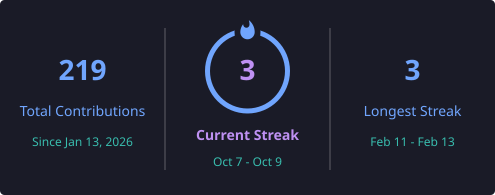

# 👋 Hi, I'm Ganesh Kumar

### 🚀 Full Stack Developer | AI/ML Enthusiast | Data Analyst

I am passionate about building modern web applications, AI-powered solutions,
and data-driven projects.

---

## 🛠️ Tech Stack

### 💻 Languages
- JavaScript
- TypeScript
- Python
- SQL
- HTML
- CSS

### ⚛️ Frontend
- React.js
- Next.js
- Tailwind CSS

### 🧠 AI / ML
- Machine Learning
- Generative AI
- NLP
- Scikit-learn
- Pandas
- NumPy

### 🔧 Backend
- Node.js
- Express.js
- REST APIs
- MongoDB

### ☁️ Tools
- Git
- GitHub
- VS Code
- Postman

---

# 🔥 GitHub Streak

  

---

# 📊 GitHub Activity

  

---

# 🚀 Featured Projects

### 📚 Ganit-Sathi
An NCERT-based mathematics learning platform for students from Class 1–12.

### 🤖 AI Teaching Assistant
An AI-powered teaching assistant designed to help teachers generate educational content and quizzes.

### 🌍 GeoVerse Mining
A project focused on mining and geographical data visualization.

---

# 📫 Connect With Me

---

  ⭐ Thanks for visiting my profile!

